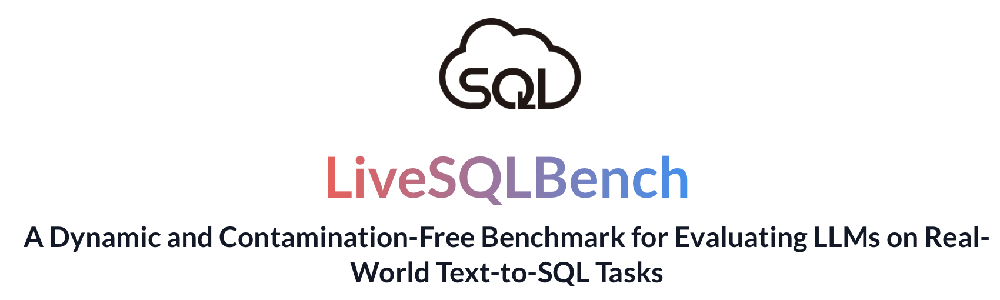

#  LiveSQLBench  


<div style="display: flex; justify-content: center; align-items: center; gap: 10px;">
  <a href="https://creativecommons.org/licenses/by-sa/4.0/deed.en">
    
  </a>
  <a href="https://livesqlbench.ai">
    
  </a>
  <a href="https://huggingface.co/datasets/birdsql/livesqlbench-base-lite/">
    
  </a>
  <a href="https://www.python.org/downloads/release/python-310/">
    
  </a>
  <a href="https://pypi.org/project/openai/">
    
  </a>
</div>


<p align="center">
  
</p>

## News

- 📢 **[2025-05-30]** We are pleased to release [**LiveSQLBench-Base-Lite**](https://huggingface.co/datasets/birdsql/livesqlbench-base-lite), featuring 18 end-user level databases and 270 tasks (180 SELECT-only, 90 Management tasks). Each task involves unambiguous and straightforward user queries grounded in external knowledge, with medium to hard complexity SQL statements.


## 🚀 Overview

LiveSQLBench (BIRD-SQL Pro v0.5) is a **contamination-free**, **continuously evolving** benchmark designed to evaluate LLMs on **complex, real-world text-to-SQL tasks**, featuring **diverse real-world user queries**, including **Business Intelligence (BI)**, **CRUD operations**, and more. Each release will include **50 new, fully open-source DBs** curated by the BIRD team through expert collaboration and continuous improvement. It will cover a **wide range of database sizes**, from **end-user level** (around 127 columns) to **industrial level** (1340+ columns).

Here are the features of the LiveSQLBench benchmark:

1. **🗄️ Live Databases:**
Constructed dynamically from extensive and regularly updated CSV datasets, with both base (user-end level) and large (industrial level) versions (1340+ columns each DB) to test scalability.

2. **💬 Live User Queries and SQL:**
Each task pairs unambiguous user queries with annotated, gold-standard SQL statements. The user queries are grounded in an external knowledge base, with medium to hard complexity solution SQL statements.

3. **🧠 Contextual Reasoning (HKB):**
Every DB includes a hierarchical knowledge base (HKB) where each knowledge may have dependencies to others, which requires the multi-hop reasoning ability. Two HKB formats are provided: (1) structured JSON format, and (2) unstructured Document format.

4. **🔍 The First Full SQL Spectrum:**
Supports not just SELECT (Business Intelligence) queries, but also CRUD (e.g., UPDATE, CREATE, and other database management operations) queries.

5. **⚡ Automated Evaluation:**
Support fast evaluation via PostgreSQL template & docker. Each question includes verifiable test cases for accurate, reproducible scoring. Soft EX metric is used to evaluate SELECT-ONLY tasks; customized test cases are designed for DBA tasks, such as CRUD (CREATE, READ, UPDATE, DELETE). 

6. **🔄 Truly Live & Hidden Test:**
New databases and tasks are added over time. Each release features both open development and hidden test phases. The hidden test set from each release becomes the open development set for the next release, ensuring continuous evolution and fair evaluation.

### 🎯 Current Release: LiveSQLBench-Base-Lite

Currently, we are pleased to release **LiveSQLBench-Base-Lite**, featuring:
- **18 end-user level databases**
- **270 tasks** (180 SELECT-only, 90 Management tasks)
- **HKB-JSON** and **JSON operation in SQL** for trial
-  Each task involves unambiguous and straightforward user queries grounded in external knowledge, with medium to hard complexity SQL statements.


## 📦 Dataset Details

### Dataset Description

- **Database:** The database can be downloaded from [the HuggingFace](https://huggingface.co/datasets/birdsql/livesqlbench-base-lite)
- **Data Fields:**
   - `instance_id`: Unique task identifier
   - `selected_database`: Associated database name
   - `query`: Ambiguous user query
   - `sol_sql`: Ground truth SQL solution
   - `external_knowledge`: IDs of required external knowledge
   - `preprocess_sql`: SQL setup queries
   - `clean_up_sql`: SQL queries to reset database state
   - `test_cases`: Test cases to validate the predicted SQL
   - `category`: "Query" (SELECT-only) or "Management" (CRUD)
   - `high_level`: Boolean for high-level description
   - `conditions`: Indicates decimal/distinct conditions
   - `difficulty_tier`: Task difficulty (Simple, Moderate, Challenging)

**Data viewer**: Explore our data through data viewer in our website [livesqlbench.ai](https://livesqlbench.ai).

🔐 To avoid data leakage by auto-crawling, certain fields (e.g., `sol_sql`, `test_cases`, `external_knowledge`) are excluded from the public dataset `livesqlbench_data.jsonl`. For the full dataset, please email: **[📧 bird.bench25@gmail.com](mailto:bird.bench25@gmail.com)** with subject tag `[livesqlbench-base-lite GT&Test Cases]`, which will be sent automatically.


## 💨 Quick Eval

### Prepare the Dataset

Download the dataset containing DB's hkb, column meaning, schema and the `livesqlbench_data.jsonl` file:
```bash
cd livesqlbench
git clone https://huggingface.co/datasets/birdsql/livesqlbench-base-lite
```
The dataset `livesqlbench_data.jsonl` does not contain the annotated fields. After **emailing** to us, you can receive a ground truth data file only containing the `instance_id`, `sol_sql`, `test_cases`, and `external_knowledge`. Please **manually combine** it with the `livesqlbench_data.jsonl` to get the full dataset.


### Environment Setup
To run the baseline code you need to install the following dependencies:
```bash
conda create -n livesqlbench python=3.10 -y
conda activate livesqlbench
pip install -r requirements.txt
```

### Generation
You also need to setup the model name (eg., **gpt-4o-2024-11-20**) with the API key in the `config.py` file. Then you can run the following command to generate the output:
```bash
# Generate the prompt
cd baseline/run
bash generate_prompt.sh

# LLM Inference, need to set the API key in config.py
bash run_baseline.sh
```
The output will be save in the [`./evaluation/outputs/final_output/`](./evaluation/outputs/final_output/)

### Evaluation
We use **docker** to provide a consistent environment for running the benchmark. To set up the environment, follow these steps:

1. First download the PostgreSQL database from [the Google Drive](https://drive.google.com/file/d/1KABce6czIqL9kMyIX7i-_A0CIQoDnmyW/view?usp=sharing).
2. Unzip the folder and save it in the [`./evaluation`](./evaluation) named with `postgre_table_dumps`
3. Build the docker compose
```bash
cd evaluation
docker compose up --build
```
4. Interact with the PostgreSQL database (Optional)
Use the `perform_query_on_postgresql_databases()` function in the `evaluation/src/db_utils.py` file to interact with the PostgreSQL database. `query` is the SQL query you want to run, and `db_name` is the name of the database you want to run the query on. The function will return the result of the query.
5. Run the evaluation script inside the `so_eval_env` container
```bash
docker compose exec so_eval_env bash
cd run
bash run_eval.sh 
```
The output will be save in the [`./evaluation/outputs/final_output/`](./evaluation/outputs/final_output/)
If you want the log file for each instance, you can set the `--logging` to `true` in the `run_eval.sh` script.


## 📊 Model Performance on LiveSQLBench-Base-Lite (2025-05-28)

| Rank | Model | Success Rate (%) | Avg. Cost (USD) / Task |
|------|-------|------------------|----------------------|
| 🥇 1 | o3-mini | 44.81 | 0.0233 |
| 🥈 2 | GPT-4.1 | 40.00 | 0.0336 |
| 🥉 3 | o4-mini | 37.80 | 0.0231 |
> More results can be found [here](https://livesqlbench.ai)

## 🔄 Upcoming Releases

- **🔄 LiveSQLBench-Base-Full:** 600 BI tasks, 200 management tasks, Document-based HKB
- **🔄 LiveSQLBench-Large-Lite:** Industrial-scale databases with 1340+ columns
- **🔄 LiveSQLBench-Large-Full:** Comprehensive large-scale datasets

Want new dialects? Vote for new SQL dialects [🗳️ here](https://docs.google.com/forms/d/e/1FAIpQLSfEogmsA7LObI13KOoiojdnYfW28KEqvEVtC9hXaZJ8O9aCpQ/viewform?usp=header)!

## Created By:
BIRD Team & Google Cloud