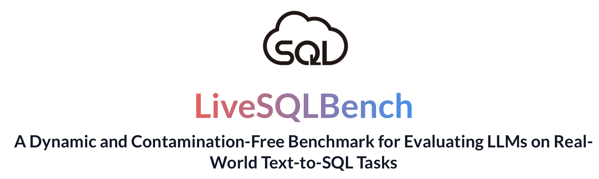

#  LiveSQLBench  


<div style="display: flex; justify-content: center; align-items: center; gap: 10px;">
  <a href="https://creativecommons.org/licenses/by-sa/4.0/deed.en">
    
  </a>
  <a href="https://livesqlbench.ai">
    
  </a>
  <a href="https://huggingface.co/datasets/birdsql/livesqlbench-base-lite/">
    
  </a>
  <a href="https://www.python.org/downloads/release/python-310/">
    
  </a>
  <a href="https://pypi.org/project/openai/">
    
  </a>
</div>


<p align="center">
  
</p>

## News

- 🖥️ **[2026-04-04]** We release **[LiveSQLBench-CLI](./LiveSQLBench-CLI/)**, a Harbor-based evaluation framework for benchmarking CLI-based agents (OpenHands, Claude Code, Aider, etc.) on LiveSQLBench tasks via terminal interactions. Supports both base-lite and base-full-v1 datasets. Check the [README](./LiveSQLBench-CLI/README.md) for details.

- 🚀 **[2026-04-04]** We release **[LiveSQLBench-Agent](./LiveSQLBench-Agent/)**, a Google ADK-based text-to-SQL agent framework with multi-provider LLM support, per-task DB isolation, and parallel execution. Check the [README](./LiveSQLBench-Agent/README.md) for details.

- 🔥🔥🔥 **[2026-03-02]** We are pleased to release <a href="https://huggingface.co/datasets/birdsql/livesqlbench-large-v1" target="_blank" rel="noopener noreferrer"><b>LiveSQLBench-Large-v1</b></a>, the industrial-scale counterpart with <b>18 databases</b> (~1K columns each) and <b>480 tasks</b>. <b>NEW FEATURES</b>: 10x schema complexity, ~84K avg prompt tokens for long-context challenge, and Business Rule Drift for live context-learning evaluation.

- 🔥 **[2026-02-26]** Thrilled to have our **[BIRD-Interact](https://bird-interact.github.io)**, based on LiveSQLBench, accepted at **ICLR 2026 (Oral)**!

- 🚀 **[2025-10-23]**  **Docker update**: We added the docker for Full DB Env. And we pushed 3 docker images (Base-Lite/Full DB Env and the evaluation environment) to Docker Hub to facilitate the environment setup. No need to download the DB dumps and build the images manually!

- 🔥🔥🔥 **[2025-09-04]** We are pleased to release <a href="https://huggingface.co/datasets/birdsql/livesqlbench-base-full-v1" target="_blank" rel="noopener noreferrer"><b>LiveSQLBench-Base-Full v1</b></a>, a new release with <b>600 NEW tasks</b> over <b>22 NEW real, complex databases</b> with KB docs.<b>NEW FEATURES</b>: more natural, reasoning-intensive user tasks and richer, noisier DB schemas/values. See the <a href="https://huggingface.co/datasets/birdsql/livesqlbench-base-full-v1" target="_blank" rel="noopener noreferrer">dataset</a> and [leaderboard](https://livesqlbench.ai) for details


- 📢 **[2025-07-28]** We are pleased to release [**LiveSQLBench-Base-Lite-SQLite**](https://huggingface.co/datasets/birdsql/livesqlbench-base-lite-sqlite), extending from PostgreSQL to SQLite dialect to improve accessibility. Please check another repo [BIRD-Mini-Dev v2](https://github.com/bird-bench/mini_dev/tree/main/live_sql_bench_sqlite) and [dataset](https://huggingface.co/datasets/birdsql/livesqlbench-base-lite-sqlite) for more details.

- 📢 **[2025-05-30]** We are pleased to release [**LiveSQLBench-Base-Lite**](https://huggingface.co/datasets/birdsql/livesqlbench-base-lite), featuring 18 end-user level databases and 270 tasks (180 SELECT-only, 90 Management tasks). Each task involves unambiguous and straightforward user queries grounded in external knowledge, with medium to hard complexity SQL statements.


## 🚀 Overview

LiveSQLBench (BIRD-SQL Pro v0.5) is a **contamination-free**, **continuously evolving** benchmark designed to evaluate LLMs on **complex, real-world text-to-SQL tasks**, featuring **diverse real-world user queries**, including **Business Intelligence (BI)**, **CRUD operations**, and more. Each release will include **50 new, fully open-source DBs** curated by the BIRD team through expert collaboration and continuous improvement. It will cover a **wide range of database sizes**, from **end-user level** (around 127 columns) to **industrial level** (1340+ columns).

Here are the features of the LiveSQLBench benchmark:

1. **🗄️ Live Databases:**
Constructed dynamically from extensive and regularly updated CSV datasets, with both base (user-end level) and large (industrial level) versions (1340+ columns each DB) to test scalability.

2. **💬 Live User Queries and SQL:**
Each task pairs unambiguous user queries with annotated, gold-standard SQL statements. The user queries are grounded in an external knowledge base, with medium to hard complexity solution SQL statements.

3. **🧠 Contextual Reasoning (HKB):**
Every DB includes a hierarchical knowledge base (HKB) where each knowledge may have dependencies to others, which requires the multi-hop reasoning ability. Two HKB formats are provided: (1) structured JSON format, and (2) unstructured Document format.

4. **🔍 The First Full SQL Spectrum:**
Supports not just SELECT (Business Intelligence) queries, but also CRUD (e.g., UPDATE, CREATE, and other database management operations) queries.

5. **⚡ Automated Evaluation:**
Support fast evaluation via PostgreSQL template & docker. Each question includes verifiable test cases for accurate, reproducible scoring. Soft EX metric is used to evaluate SELECT-ONLY tasks; customized test cases are designed for DBA tasks, such as CRUD (CREATE, READ, UPDATE, DELETE). 

6. **🔄 Truly Live & Hidden Test:**
New databases and tasks are added over time. Each release features both open development and hidden test phases. The hidden test set from each release becomes the open development set for the next release, ensuring continuous evolution and fair evaluation.

7. **📈 Business Rule Drift (Live Context-Learning):**
Business rules embedded in external knowledge can change across releases, requiring models to adapt to updated context rather than relying on memorized patterns.

### 🎯 Current Release: LiveSQLBench-Base-Lite, LiveSQLBench-Base-Full v1, and LiveSQLBench-Large-v1

We currently release three versions:
- **LiveSQLBench-Base-Lite**: 18 end-user level databases and 270 tasks, with straightforward queries and HKB-JSON.
- **LiveSQLBench-Base-Full v1**: 22 end-user level databases and 600 tasks, with more natural, reasoning-intensive queries and richer/noisier schemas and values.
- **LiveSQLBench-Large-v1**: 18 industrial-scale databases (~1K columns and ~54 tables per DB) and 480 tasks, featuring 10x schema complexity over Base-Full v1, ~84K avg prompt tokens for long-context challenge, and Business Rule Drift evaluation for live context-learning.


## 📦 Dataset Details

### Dataset Description

- **Database:** The databases can be downloaded from [livesqlbench-base-lite](https://huggingface.co/datasets/birdsql/livesqlbench-base-lite), [livesqlbench-base-full-v1](https://huggingface.co/datasets/birdsql/livesqlbench-base-full-v1), and [livesqlbench-large-v1](https://huggingface.co/datasets/birdsql/livesqlbench-large-v1)
- **Data Fields:**
   - `instance_id`: Unique task identifier
   - `selected_database`: Associated database name
   - `query`: User query
   - `sol_sql`: Ground truth SQL solution
   - `external_knowledge`: IDs of required external knowledge
   - `preprocess_sql`: SQL setup queries
   - `clean_up_sql`: SQL queries to reset database state
   - `test_cases`: Test cases to validate the predicted SQL
   - `category`: "Query" (SELECT-only) or "Management" (CRUD)
   - `high_level`: Boolean for high-level description
   - `conditions`: Indicates decimal/distinct conditions
   - `difficulty_tier`: Task difficulty (Simple, Moderate, Challenging)

**Data viewer**: Explore our data through data viewer in our website [livesqlbench.ai](https://livesqlbench.ai).

🔐 To avoid data leakage by auto-crawling, certain fields (e.g., `sol_sql`, `test_cases`, `external_knowledge`) are excluded from the public dataset `livesqlbench_data.jsonl`. For the full dataset, please email: **[📧 bird.bench25@gmail.com](mailto:bird.bench25@gmail.com)** with subject tag 
- `[livesqlbench-base-lite GT&Test Cases]` for **livesqlbench-base-lite** version or 
- `[livesqlbench-base-full-v1 GT&Test Cases]` for **livesqlbench-base-full-v1** version or
- `[livesqlbench-large-v1 GT&Test Cases]` for **livesqlbench-large-v1** version, which will be sent automatically.


## 💨 Quick Eval (LiveSQLBench-Base-Lite)

### Prepare the Dataset

Download the dataset containing DB's hkb, column meaning, schema and the `livesqlbench_data.jsonl` file:
```bash
cd livesqlbench
git clone https://huggingface.co/datasets/birdsql/livesqlbench-base-lite
```

Integrate the data file containing the annotated fields (obtained from the email) with the `livesqlbench_data.jsonl` file by running the following command:
```bash
python integrate_gt_data.py --gt_file <path_to_gt_file> 
```


### Generation Environment Setup
To run the baseline code to generate LLM outputs, you need to install the following dependencies:
```bash
conda create -n livesqlbench python=3.10 -y
conda activate livesqlbench
pip install -r requirements.txt
```

### Generation
You also need to setup the model name (eg., **gpt-4o-2024-11-20**) with the API key in the `config.py` file. Then you can run the following command to generate the output:
```bash
# Generate the prompt
cd baseline/run
bash generate_prompt.sh

# LLM Inference, need to set the API key in config.py
bash run_baseline.sh
```
The output will be save in the [`./evaluation/outputs/final_output/`](./evaluation/outputs/final_output/)


### Evaluation Environment Setup

We use **docker** to provide a consistent environment for running the benchmark. To set up the environment, follow these steps:

1. Build the docker compose using pre-built images
    ```bash
    cd evaluation
    docker compose pull
    docker compose up 
    ```
    This contains three containers:
    - `livesqlbench_postgresql`: the PostgreSQL database for the base-lite DB Environment
    - `livesqlbench_postgresql_base_full`: the PostgreSQL database for the base-full DB Environment
    - `livesqlbench_so_eval_env`: the environment for the evaluation

    Just comment out the `postgresql_base_full` service in the `docker-compose.yml` file if you only want to evaluate the base-lite version.


2. (Optional) Build the docker images from scratch
   - Downdload the database dumps 
      - [livesqlbench-base-lite](https://drive.google.com/file/d/1QIGQlRKbkqApAOrQXPqFJgUg8rQ7HRRZ/view). Unzip and rename it as `evaluation/postgre_table_dumps`.
      - [livesqlbench-base-full](https://drive.google.com/file/d/1V9SFIWebi27JtaDUAScG1xE9ELbYcWLR/view). Unzip and rename it as `evaluation/postgre_table_dumps_full`.
      - [livesqlbench-large-v1](https://drive.google.com/file/d/1u1L-SvJtOZGfcIST-dINw8DnGEQDMu6C/view?usp=sharing). Unzip and rename to `evaluation/postgre_table_dumps_large_v1`.
   - Build the environment manually by running `docker-compose.build.yml`.
      ```bash
      cd evaluation
      docker compose -f docker-compose.build.yml build
      docker compose -f docker-compose.build.yml up -d
      ```

3. (Recommended) Check the database containers are built and running successfully.

-  Print the container build logs to ensure that the databases are built successfully without errors:
   ```bash 
   docker logs livesqlbench_postgresql > build_livesqlbench_postgresql.log 2>&1
   docker logs livesqlbench_postgresql_base_full > build_livesqlbench_postgresql_base_full.log 2>&1
   ```
   If errors occur, `"Errors occurred during import:"` will be printed in the log files.


-  Check if the database containers are in good shape.
   
   Use our provided Python script to verify database metadata:
   ```bash
   docker compose exec so_eval_env bash
   python check_db_metadata.py --host livesqlbench_postgresql
   python check_db_metadata.py --host livesqlbench_postgresql_base_full
   python check_db_metadata.py --host livesqlbench_postgresql_large_v1
   ```
   
   Expected results:
   - **livesqlbench-base-lite**: 
     - 📈 Total Databases: 18
     - 📋 Total Tables: 175
     - 🔢 Total Columns: 2286
     - 📈 Avg Rows per Table: 1,038.48
     - 💾 Total Size: 207.15 MB (around)
   - **livesqlbench-base-full**: 
     - 📈 Total Databases: 22
     - 📋 Total Tables: 244
     - 🔢 Total Columns: 2011
     - 📈 Avg Rows per Table: 1,121.19
     - 💾 Total Size: 272.00 MB (around)
   - **livesqlbench-large-v1**:
     - 📈 Total Databases: 18
     - 📋 Total Tables: 971
     - 🔢 Total Columns: 17,749
     - 📈 Avg Rows per Table: 2,056.48
     - 💾 Total Size: 746.33 MB
   

### Evaluation Run
Exec into the `livesqlbench_so_eval_env` container and start the evaluation:
```bash
docker compose exec so_eval_env bash
cd run
bash run_eval.sh 
```
The output will be save in the [`./evaluation/outputs/final_output/`](./evaluation/outputs/final_output/)
If you want the log file for each instance, you can set the `--logging` to `true` in the `run_eval.sh` script.

## 💨 Quick Eval (LiveSQLBench-Base-Full and LiveSQLBench-Large-v1)

Similar to the above, but do the following changes:

1. Change the databaes metafiles and data.jsonl to the version from [livesqlbenc-base-full-v1](https://huggingface.co/datasets/birdsql/livesqlbench-base-full-v1) or [livesqlbench-large-v1](https://huggingface.co/datasets/birdsql/livesqlbench-large-v1).
2. Use the new data to generate the prompts and then use the new generated prompt get LLM outputs and then postprocess it.
3. When running the evaluation, you need to set the database host to `livesqlbench_postgresql_base_full` for livesqlbench-base-full-v1 and `livesqlbench_postgresql_large_v1` for livesqlbench-large-v1:
```bash
docker compose exec so_eval_env bash
cd run
jsonl_file=<path_to_your_postprocessed_jsonl_file>
python3 /app/src/evaluation.py --jsonl_file $jsonl_file --db_host "livesqlbench_postgresql_base_full" # Or --db_host "livesqlbench_postgresql_large_v1" for livesqlbench-large-v1
```


## 🤖 LiveSQLBench-Agent

We also provide **LiveSQLBench-Agent**, a Google ADK-based text-to-SQL agent framework under [`LiveSQLBench-Agent/`](./LiveSQLBench-Agent/). The agent iteratively explores the database through tools (schema inspection, column meanings, external knowledge, SQL execution) before submitting a final answer.

**Key features:**
- **Microservices architecture**: System Agent + DB Environment + Orchestrator
- **Multi-provider LLM support** via LiteLlm (Anthropic, OpenAI, Ollama, etc.)
- **Per-task DB isolation** with PostgreSQL template-based cloning
- **Parallel execution** with configurable concurrency
- **Step-based budget enforcement** (default 30 steps per task)
- **HTML report generation** with tool trajectory visualization

Please refer to the [LiveSQLBench-Agent README](./LiveSQLBench-Agent/README.md) for setup and usage instructions.


## 🖥️ LiveSQLBench-CLI

We provide **LiveSQLBench-CLI**, a [Harbor](https://github.com/harbor-framework/harbor)-based evaluation framework under [`LiveSQLBench-CLI/`](./LiveSQLBench-CLI/) for benchmarking CLI-based agents on LiveSQLBench text-to-SQL tasks. Agents interact with the database environment solely through bash commands in a sandboxed terminal.

**Key features:**
- **CLI-based agent support**: OpenHands, Claude Code, Aider, Codex, Gemini CLI, and more
- **Terminal-only interaction**: Agents explore schemas, query databases, and submit SQL entirely via bash
- **Per-task isolation**: Each task runs in its own Docker container with a dedicated PostgreSQL instance
- **Supports all datasets**: LiveSQLBench-Base-Lite and Base-Full v1

Please refer to the [LiveSQLBench-CLI README](./LiveSQLBench-CLI/README.md) for setup and usage instructions.


## 📊 Model Performance on LiveSQLBench

LiveSQLBench-Base-Lite (2025-05-28)

| Rank | Model | Success Rate (%) | Avg. Cost (USD) / Task |
|------|-------|------------------|----------------------|
| 🥇 1 | o3-mini | 47.78 | 0.0233 |
| 🥈 2 | GPT-4.1 | 44.10 | 0.0336 |
| 🥉 3 | Claude Sonnet 4 | 42.59 | 0.0623 |

More results can be found [here](https://livesqlbench.ai)

## 🔄 Upcoming Releases

- [x] **🔄 LiveSQLBench-Base-Lite:** 18 NEW databases and 270 NEW tasks with straightforward, direct queries. 
- [x] **🔄 LiveSQLBench-Base-Full:** 22 NEW databases and 600 NEW tasks with more natural, reasoning-intensive user tasks and richer, noisier DB schemas/values.
- [ ] **🔄 LiveSQLBench-Large-Lite:** Industrial-scale databases with 1340+ columns
- [ ] **🔄 LiveSQLBench-Large-Full:** Comprehensive large-scale datasets


### 📊 Feature Comparison

| Feature | LiveSQLBench-Base-Lite | LiveSQLBench-Base-Full | LiveSQLBench-Large-Full |
|---------|------------------------|------------------------|-------------------------|
| **User Tasks** | • 270 tasks<br>• Clear, direct queries with explicit DB/HKB connections<br>• Example1* | • 600 tasks <br>• Natural, colloquial queries with implicit DB/HKB connections<br>• Example2* | • 600 tasks<br>• Natural, colloquial queries with implicit DB/HKB connections<br>• Example2*, but with large DBs (industrial-scale DB)|
| **Database** | • 18 base databases<br>• ~127 columns per DB<br>• Simple 1:1 relationships<br>• Clean data (no nulls, consistent formats) | • 22 base databases<br>• ~127 columns per DB<br>• Complex relationships (1:1, 1:N, N:1, N:N)<br>• Real-world data quality (e.g., nulls, duplicates, inconsistent formats) | • 22 large databases<br>• ~1,340 columns per DB<br>• Complex relationships (1:1, 1:N, N:1, N:N)<br>• Real-world data quality (e.g., nulls, duplicates, inconsistent formats) |
| **Hierarchical Knowledge Base (HKB)** | • Structured HKB-JSON format only | • Dual format support:<br>1. Structured HKB-JSON<br>2. Unstructured HKB-Document (coming soon) | • Dual format support:<br>1. Structured HKB-JSON<br>2. Unstructured HKB-Document (coming soon) |

\* Example1 (more formal): *"For our archaeological site evaluation, I need to quantify the Digital Preservation Quality metrics across our collection. Please compute a comprehensive DPQ index for each archaeological location. Present the results in descending order of DPQ values, displaying only the site identification code, site designation, and calculated DPQ value (rounded to two decimal places) to facilitate prioritization of our digital preservation resources."*

\* Example2 (more colloquial): *"To better allocate our digital preservation resources, I need to identify which archaeological sites have the most robust digital records. Can you generate a ranked list showing each site's primary identifier, its designation, and a metric quantifying its digital preservation quality? Please sort the list to show the highest-quality sites first, with the quality metric rounded to the second decimal."*


Want new dialects? Vote for new SQL dialects [🗳️ here](https://docs.google.com/forms/d/e/1FAIpQLSfEogmsA7LObI13KOoiojdnYfW28KEqvEVtC9hXaZJ8O9aCpQ/viewform?usp=header)!

## Created By:
BIRD Team & Google Cloud

## Citation
If you find this work useful, please cite:
```bibtex
@misc{livesqlbench2025,
  author       = {BIRD Team},
  title        = {LiveSQLBench: A Dynamic and Contamination-Free Benchmark for Evaluating LLMs on Real-World Text-to-SQL Tasks},
  year         = {2024},
  howpublished = {https://github.com/bird-bench/livesqlbench},
  note         = {Accessed: 2025-05-22}
}
```


## Changelog

<!-- summary -->

<details>
<summary>Changelog</summary>

All notable changes to this project will be documented in this file.

### 2025-09-04
- Released LiveSQLBench-Base-Full v1 with 600 NEW tasks over 22 NEW real, complex databases with KB docs.
- New features: more natural, reasoning-intensive user tasks and richer, noisier DB schemas/values.
- The leaderboard is updated with some LLM results (e.g., GPT-5, gemini-2.5-pro).

### 2025-06-06
- SQL evaluation postprocessing improvements:
  - Removed rounding in SQL postprocessing step
  - Added rounding of execution results to 2 decimal places
  - Modified comparison logic for ordered conditions:
    - Using list comparison when "order" is True in conditions
    - Using set comparison when "order" is False in conditions
</details>
